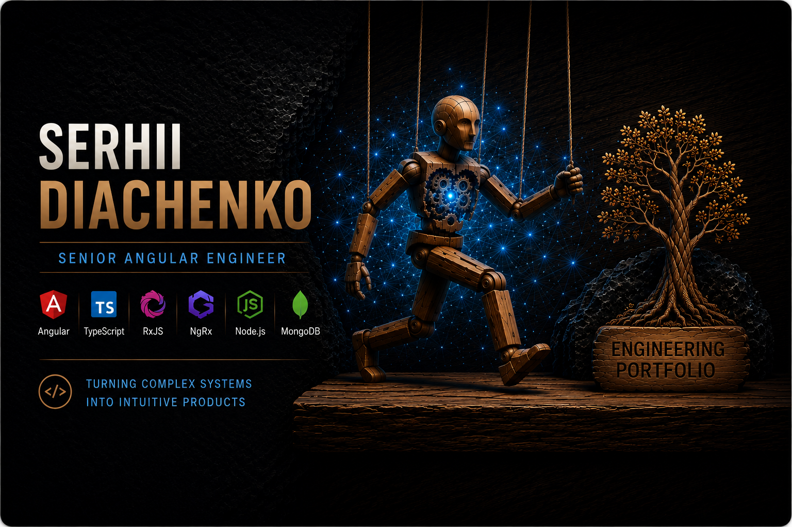

  

# Hi, I'm Serhii 👋

Senior Angular Engineer with 10+ years of experience building enterprise SaaS applications, data-intensive dashboards, and scalable frontend systems.

I specialize in transforming complex business requirements into maintainable, high-performance products with a strong focus on architecture, developer experience, and long-term scalability.

## Technical Expertise

- Angular (2–22)
- AngularJS
- TypeScript
- RxJS
- NgRx
- Signals & Signal Forms
- Node.js
- Frontend Architecture
- Design Systems
- Performance Optimization

## What I Enjoy Building

- Scalable frontend architectures
- Data-intensive applications
- Reusable UI platforms and component libraries
- Predictable state management solutions
- Real-time and asynchronous user experiences
- Maintainable systems that can evolve with growing products and teams

## Featured Project

### GM Vocabulary

A modern vocabulary learning platform built with Angular 22, Node.js, and MongoDB.

**Highlights**

- Authentication & Authorization
- Signal Forms
- Signal Store
- REST API Integration
- Docker-based Development Environment
- Modern Angular Architecture

🔗 [Repository](https://github.com/sgdiachenko/gm-vocabulary)

## Currently Exploring

- Domain-Driven Design (DDD)
- Strategic Monoliths & Microservices
- NestJS
- React Ecosystem
- AI-Assisted Engineering Workflows

## Connect

- [LinkedIn](https://www.linkedin.com/in/sgdyachenko/)